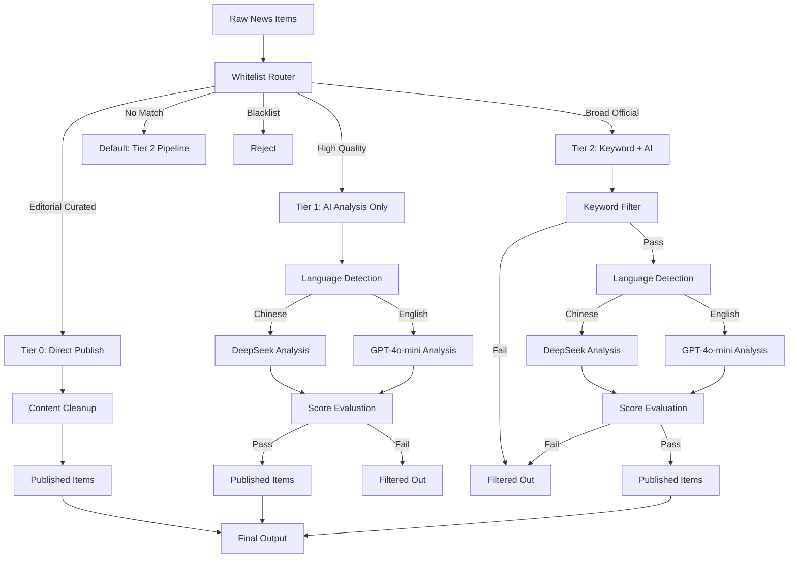

# AI Content Filtering Guide

Complete guide to the three-tier AI content filtering system for AI News Radar.

## Table of Contents

- [Quick Start](#quick-start)
- [System Architecture](#system-architecture)
- [AI Model Selection](#ai-model-selection)
- [Configuration](#configuration)
- [Frontend Personalization](#frontend-personalization)
- [Troubleshooting](#troubleshooting)
- [Testing](#testing)
- [Performance Metrics](#performance-metrics)
- [References](#references)

---

## Quick Start

### Environment Setup

1. Install dependencies:
```bash
pip install -r requirements.txt
```

2. Set up API keys:
```bash
# Copy example environment file
cp .env.example .env

# Edit .env and add your API keys
# Required: OPENAI_API_KEY (for GPT-4o-mini)
# Optional: DEEPSEEK_API_KEY (for Chinese content), ANTHROPIC_API_KEY
```

3. Verify configuration:
```bash
# Check whitelist configuration
cat config/source-whitelist.yaml

# Run configuration validation
python scripts/ai_filter/whitelist_router.py --validate
```

### Running the Filter

Basic usage:
```bash
# Update news with AI filtering
python scripts/update_news.py --output-dir data --window-hours 24

# Filter runs automatically as part of the update pipeline
```

Check filtering results:
```bash
# View latest filtered news
cat data/latest-items.json | jq '.[] | {title, tier: ._tier, ai_score: .ai_design_relevance}'

# View filtering statistics
cat data/source-status.json | jq '.filter_stats'
```

---

## System Architecture

### Three-Tier Whitelist System

The AI filter uses a three-tier approach based on source trust and content characteristics:



### Processing Flow by Tier

#### Tier 0: Editorial Curated Sources (Direct Publish)

**Characteristics:**
- Content already filtered by professional editors
- High signal-to-noise ratio
- Trusted sources with consistent quality

**Examples:**
- UX Collective (Medium's largest UX column)
- Awwwards (professional jury selected)
- Sidebar (5 best design links daily)
- Muzli, Codrops, Web Designer Depot

**Processing:**
```
Input → Content Cleanup → Direct Publish
```

No AI filtering needed. Items are enriched with tier metadata and published immediately.

#### Tier 1: High Quality Sources (AI Analysis Only)

**Characteristics:**
- High quality content but broad scope
- Need AI to determine relevance
- Skip keyword filtering to avoid false negatives

**Examples:**
- UISDC (优设网) - Chinese design community
- UX Collective Weekly - newsletter with diverse content

**Processing:**
```
Input → Language Detection → AI Deep Analysis → Score Check → Publish/Reject
```

**AI Decision Criteria:**
- `design_relevance >= 0.6` OR `quality_score >= 7`
- Focus on AI design tutorials, tool reviews, and case studies

#### Tier 2: Broad Official Sources (Full Pipeline)

**Characteristics:**
- Official sources with broad content scope
- Need strict filtering for specific topics
- Keyword pre-filter to reduce AI costs

**Examples:**
- Figma Blog (official but covers many topics)
- OpenAI Blog (many research papers, only want product launches)
- SSPAI (少数派) - efficiency tools platform (focus on AI coding)
- AI HOT - aggregator (filter for latest models, tools, tutorials)

**Processing:**
```
Input → Keyword Pre-filter → Language Detection → AI Analysis → Score Check → Publish/Reject
```

**Filter Focus Examples:**
- Figma: New features, AI capabilities, Config conference
- OpenAI: Product launches, API updates (exclude pure research)
- SSPAI: AI coding tools (Cursor, GitHub Copilot)
- AI HOT: Latest models, AI coding tools, practical tutorials

---

## AI Model Selection

### Language-Based Routing

The system automatically selects the optimal AI model based on content language:

```python
# Language detection
if has_chinese_characters(title):
    language = "zh"
    model = "deepseek-chat"
else:
    language = "en"
    model = "gpt-4o-mini"
```

### Model Comparison

| Model | Language | Cost | Use Case | Advantages |
|-------|----------|------|----------|------------|
| DeepSeek-Chat | Chinese | Lower | Chinese content analysis | Native Chinese understanding, cost-effective |
| GPT-4o-mini | English | Moderate | English content analysis | Strong reasoning, consistent output |
| Claude Sonnet | Any | Higher | High-priority items | Best quality, extended context (optional) |

### API Configuration

EasyRouter client provides unified interface:

```python
from scripts.ai_filter.easyrouter_client import EasyRouterClient

client = EasyRouterClient()

# Automatically routes to appropriate model
response = client.call_model(
    model="deepseek-chat",  # or "gpt-4o-mini"
    messages=[{"role": "user", "content": prompt}],
    temperature=0.3
)
```

API keys are loaded from environment variables:
- `OPENAI_API_KEY` - Required for English content
- `DEEPSEEK_API_KEY` - Optional, for Chinese content
- `ANTHROPIC_API_KEY` - Optional, for premium filtering

---

## Configuration

### Whitelist Configuration File

Location: `config/source-whitelist.yaml`

#### Structure

```yaml
version: "1.0"
description: |
  Tier 0: Editorial curated - direct publish
  Tier 1: High quality - AI deep analysis
  Tier 2: Broad official - full filtering pipeline

tier_0_sources:
  - id: ux_collective
    name: "UX Collective"
    patterns:
      - "uxdesign.cc"
      - "UX Collective"
    reason: "Editorial quality control"
    update_frequency: "daily"
    expected_items_per_day: 3
    language: "en"

tier_1_sources:
  - id: uisdc
    name: "优设网"
    patterns:
      - "uisdc.com"
      - "优设网"
    reason: "High quality but needs AI relevance check"
    language: "zh"
    ai_filter_focus:
      - "AI设计教程"
      - "工具实测"
      - "设计案例"
    max_items_per_day: 3

tier_2_sources:
  - id: figma_official
    name: "Figma Blog"
    patterns:
      - "figma.com/blog"
      - "Figma"
    reason: "Official but broad content"
    language: "en"
    filter_focus:
      - "新功能发布"
      - "AI功能"
      - "产品更新"
    exclude_topics:
      - "招聘"
      - "公司文化"
      - "用户故事"
    max_items_per_day: 2

blacklist_sources:
  - id: spam
    patterns:
      - "震惊"
      - "不看后悔"
      - "你绝对想不到"
    reason: "Low quality clickbait"
```

#### Configuration Fields

**Common Fields:**
- `id`: Unique identifier
- `name`: Display name
- `patterns`: List of strings to match against source/URL/site_name
- `reason`: Explanation for categorization
- `language`: "zh" or "en"
- `update_frequency`: "daily", "weekly", "monthly"
- `expected_items_per_day`: Average expected items

**Tier 1 Specific:**
- `ai_filter_focus`: List of topics AI should prioritize
- `max_items_per_day`: Daily item limit

**Tier 2 Specific:**
- `filter_focus`: Keywords for pre-filtering (positive)
- `exclude_topics`: Topics to exclude (negative)
- `max_items_per_day`: Daily item limit

### Adding New Sources

1. Determine appropriate tier:
   - Tier 0: Is it editorially curated?
   - Tier 1: High quality but needs relevance check?
   - Tier 2: Official but needs topic filtering?

2. Add to whitelist:
```yaml
tier_1_sources:
  - id: new_source
    name: "New Design Blog"
    patterns:
      - "newdesignblog.com"
    reason: "Quality content, AI checks relevance"
    language: "en"
    ai_filter_focus:
      - "AI design tools"
      - "Design automation"
```

3. Test the configuration:
```bash
python tests/test_ai_filter/test_whitelist_router.py -v
```

4. Monitor filtering results:
```bash
python scripts/update_news.py --output-dir data --window-hours 24
cat data/source-status.json | jq '.filter_stats'
```

### AI Analysis Prompts

Location: `scripts/ai_filter/prompts.py`

The system uses structured prompts for AI analysis:

```python
def build_tier1_prompt(item: dict, source_config: dict) -> str:
    """Build prompt for Tier 1 AI analysis."""
    return f"""Analyze this design/tech content for relevance and quality.

Title: {item.get('title', 'N/A')}
Source: {source_config.get('name', 'Unknown')}
URL: {item.get('url', 'N/A')}

Focus areas: {', '.join(source_config.get('ai_filter_focus', []))}

Rate on 0-10 scale:
1. design_relevance - How relevant to AI design tools/workflows?
2. quality_score - Overall content quality?

Return JSON:
{{
  "design_relevance": 8,
  "quality_score": 7,
  "categories": ["AI工具", "设计教程"],
  "target_audience": "UI/UX设计师",
  "key_insights": "Brief summary"
}}"""
```

**Customization Tips:**
- Adjust scoring criteria in prompts
- Add domain-specific evaluation dimensions
- Tune thresholds in filter code

---

## Frontend Personalization

### User Feedback Mechanism

The frontend collects user feedback to improve filtering:

```javascript
// assets/personalization.js

// Track user interactions
function trackInteraction(itemId, action) {
    const feedback = {
        item_id: itemId,
        action: action,  // 'like', 'dislike', 'hide'
        timestamp: Date.now(),
        tier: item.tier
    };
    
    saveFeedback(feedback);
    updateRecommendations();
}
```

### Feedback Data Structure

```json
{
  "user_preferences": {
    "liked_categories": ["AI工具", "设计教程"],
    "disliked_categories": ["纯理论"],
    "hidden_sources": ["some-source-id"],
    "tier_preferences": {
      "tier_0": 0.9,
      "tier_1": 0.7,
      "tier_2": 0.5
    }
  },
  "feedback_history": [
    {
      "item_id": "abc123",
      "action": "like",
      "timestamp": 1715932800000,
      "tier": 1
    }
  ]
}
```

### Personalization Features

1. **Category Boosting**: Items from liked categories appear higher
2. **Source Filtering**: Hide disliked sources
3. **Tier Weighting**: Adjust tier visibility based on preferences
4. **Learning Over Time**: System adapts to user behavior

### Privacy

All personalization data is stored locally in browser:
- No server-side tracking
- No analytics sent to backend
- User has full control over data

---

## Troubleshooting

### Common Issues

#### 1. API Key Errors

**Symptom:**
```
Error: OpenAI API key not found
```

**Solution:**
```bash
# Set in .env file
echo "OPENAI_API_KEY=sk-..." >> .env

# Or export temporarily
export OPENAI_API_KEY=sk-...
```

#### 2. All Items Filtered Out

**Symptom:**
```json
{
  "total_input_items": 50,
  "total_output_items": 0,
  "tier_0_published": 0,
  "tier_1_published": 0,
  "tier_2_published": 0
}
```

**Possible Causes:**
- Scoring thresholds too strict
- AI analysis failing silently
- Whitelist patterns not matching

**Debug Steps:**
```bash
# Check individual item filtering
python -c "
from scripts.ai_filter.main_filter import AIContentFilter
filter = AIContentFilter()
item = {'title': 'Test', 'url': 'https://example.com', 'source': 'Test'}
result = filter.filter_item(item)
print(result)
"

# Enable debug logging
export AI_FILTER_DEBUG=1
python scripts/update_news.py --output-dir data --window-hours 24
```

#### 3. Language Detection Wrong

**Symptom:**
Chinese content analyzed with English model or vice versa.

**Solution:**
Check title encoding:
```python
from scripts.ai_filter.language_detector import detect_language

title = "测试标题"
lang = detect_language(title)
print(f"Detected: {lang}")  # Should be 'zh'
```

#### 4. High API Costs

**Symptom:**
Unexpected high API usage.

**Solution:**
- Check `max_items_per_day` limits in whitelist
- Review Tier 0 sources (should not call AI)
- Monitor token usage in logs:

```bash
# Check token usage statistics
cat data/source-status.json | jq '.filter_stats.total_tokens_used'
```

### Debug Mode

Enable verbose logging:

```bash
export AI_FILTER_DEBUG=1
export AI_FILTER_LOG_LEVEL=DEBUG

python scripts/update_news.py --output-dir data --window-hours 24 2>&1 | tee filter-debug.log
```

### Validation Tools

Test configuration validity:

```bash
# Validate YAML syntax
python -c "import yaml; yaml.safe_load(open('config/source-whitelist.yaml'))"

# Test whitelist router
python tests/test_ai_filter/test_whitelist_router.py -v

# Test tier filters
python tests/test_ai_filter/test_tier1_filter.py -v
```

---

## Testing

### Unit Tests

Run specific test suites:

```bash
# Test all AI filter components
pytest tests/test_ai_filter/ -v

# Test individual components
pytest tests/test_ai_filter/test_tier1_filter.py -v
pytest tests/test_ai_filter/test_tier2_pipeline.py -v
pytest tests/test_ai_filter/test_main_filter.py -v

# Test with coverage
pytest tests/test_ai_filter/ --cov=scripts/ai_filter --cov-report=html
```

### Integration Tests

Full pipeline test:

```bash
# Run complete update cycle
python scripts/update_news.py --output-dir test-output --window-hours 24

# Verify output
test -f test-output/latest-items.json && echo "Success" || echo "Failed"

# Check statistics
cat test-output/source-status.json | jq '.filter_stats'
```

### Test Data

Sample items for testing in `tests/test_ai_filter/fixtures/`:

```json
{
  "tier_0_item": {
    "title": "Best Design Systems 2024",
    "url": "https://uxdesign.cc/design-systems",
    "source": "UX Collective",
    "site_name": "uxdesign.cc"
  },
  "tier_1_item": {
    "title": "AI设计工具完整指南",
    "url": "https://www.uisdc.com/ai-tools-guide",
    "source": "优设网",
    "site_name": "uisdc.com"
  },
  "tier_2_item": {
    "title": "Figma announces AI features at Config 2024",
    "url": "https://figma.com/blog/config-2024-ai",
    "source": "Figma Blog",
    "site_name": "figma.com"
  }
}
```

### Continuous Integration

GitHub Actions workflow:

```yaml
# .github/workflows/test-ai-filter.yml
name: Test AI Filter

on: [push, pull_request]

jobs:
  test:
    runs-on: ubuntu-latest
    steps:
      - uses: actions/checkout@v3
      - name: Set up Python
        uses: actions/setup-python@v4
        with:
          python-version: '3.11'
      - name: Install dependencies
        run: pip install -r requirements.txt
      - name: Run tests
        run: pytest tests/test_ai_filter/ -v
```

---

## Performance Metrics

### Target Metrics

| Metric | Target | Current | Notes |
|--------|--------|---------|-------|
| Precision | >= 0.85 | TBD | % of published items that are relevant |
| Recall | >= 0.80 | TBD | % of relevant items successfully published |
| Tier 0 throughput | 100% | 100% | All Tier 0 items published |
| Tier 1 acceptance | 30-50% | TBD | AI-filtered items passing |
| Tier 2 acceptance | 20-40% | TBD | Full pipeline passing |
| Avg API latency | < 2s | TBD | Per AI call |
| Total processing time | < 5min | TBD | Full 24h window update |
| Daily API cost | < $1 | TBD | Combined model costs |

### Monitoring

Track metrics in `data/source-status.json`:

```json
{
  "filter_stats": {
    "total_input_items": 150,
    "total_output_items": 48,
    "tier_0_published": 12,
    "tier_1_published": 18,
    "tier_2_published": 18,
    "tier_1_acceptance_rate": 0.45,
    "tier_2_acceptance_rate": 0.32,
    "total_tokens_used": 45000,
    "estimated_cost_usd": 0.23,
    "processing_time_seconds": 127
  }
}
```

### Optimization Tips

1. **Reduce API Calls:**
   - Move more sources to Tier 0
   - Strengthen keyword filtering in Tier 2
   - Use caching for repeated analysis

2. **Improve Accuracy:**
   - Collect user feedback
   - Tune scoring thresholds
   - Refine AI prompts

3. **Lower Costs:**
   - Use DeepSeek for Chinese content (lower cost)
   - Batch similar items together
   - Implement rate limiting

---

## References

### Related Documentation

- [README.md](../README.md) - Project overview
- [SOURCE_COVERAGE.md](SOURCE_COVERAGE.md) - Source selection strategy
- [docs/selected-sources.md](selected-sources.md) - User-provided source list
- [skills/ai-news-radar/SKILL.md](../skills/ai-news-radar/SKILL.md) - Scout Skill guide

### Configuration Files

- [config/source-whitelist.yaml](../config/source-whitelist.yaml) - Three-tier whitelist
- [scripts/ai_filter/](../scripts/ai_filter/) - Filter implementation
- [tests/test_ai_filter/](../tests/test_ai_filter/) - Test suite

### External Resources

- [OpenAI API Documentation](https://platform.openai.com/docs)
- [DeepSeek API Documentation](https://platform.deepseek.com/docs)
- [RSS/OPML Best Practices](https://validator.w3.org/feed/docs/)

### Version History

- v1.0 (2026-05-17) - Initial release with three-tier system
- Language-based model routing
- Frontend personalization engine
- Comprehensive test coverage

---

## Support

For questions or issues:

1. Check [Troubleshooting](#troubleshooting) section
2. Review test cases in `tests/test_ai_filter/`
3. Open an issue on GitHub with:
   - Configuration file (`source-whitelist.yaml`)
   - Error logs
   - Sample items that failed filtering
   - Expected vs actual behavior

## Contributing

To improve the AI filtering system:

1. Add test cases for new scenarios
2. Tune prompts in `scripts/ai_filter/prompts.py`
3. Adjust scoring thresholds
4. Add new source patterns to whitelist
5. Submit PR with before/after metrics

---

**Last Updated:** 2026-05-17  
**System Version:** 1.0  
**Maintainer:** AI News Radar Team
