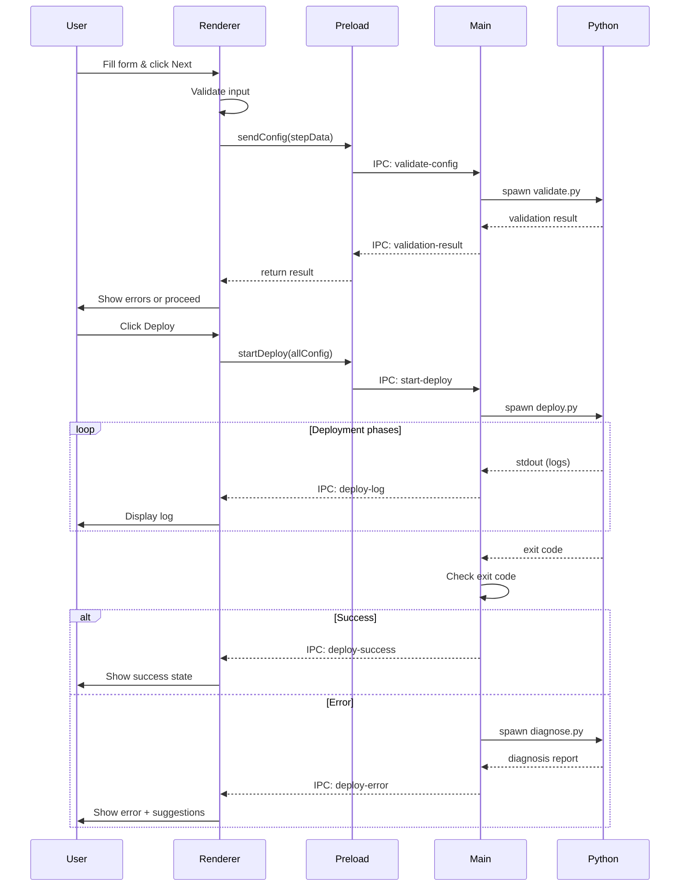

# AI Daily News - One-Click Deployer Design Specification

**Version:** 1.0  
**Date:** 2026-05-14  
**Author:** Claude Code  
**Status:** Approved

---

## Overview

A double-click macOS desktop application that simplifies AI Daily News deployment through a visual wizard interface. Users complete a 5-step guided process to configure and deploy their personalized AI news aggregator to GitHub Pages, with automatic error diagnosis and recovery.

---

## Goals

### Primary Goals
1. Eliminate manual terminal commands for non-technical users
2. Provide visual configuration for all deployment parameters
3. Automatic error detection and recovery suggestions
4. Deploy to GitHub Pages with one-click after configuration

### Non-Goals
- Cross-platform support (Windows/Linux) in v1
- Real-time preview of news feed
- Built-in OPML editor beyond basic add/remove
- Automatic GitHub account creation

---

## User Experience

### Wizard Flow

**Step 1: Basic Information**
- Input fields:
  - GitHub Username (required, validated format)
  - Email Address (required, validated format)
  - Repository Name (required, default: "ai-daily-news", validated: lowercase, hyphens only)
- Navigation: Next button (disabled until valid)

**Step 2: GitHub Authentication**
- Input field: Personal Access Token (required, masked input)
- Helper text: "Token must have 'repo' and 'workflow' permissions"
- Action link: "Get Token" → Opens https://github.com/settings/tokens/new in browser
- Validation: Test token validity via GitHub API
- Navigation: Back | Next

**Step 3: RSS Feed Configuration**
- Preset: 15 AI+Design Twitter accounts (pre-loaded from feeds/follow.example.opml)
- Actions:
  - Add new feed: Title, Feed URL, optional Category
  - Remove feed: Click X icon
  - Reorder feeds: Drag and drop
- Preview: Show feed count and categories
- Navigation: Back | Next | Skip (use preset only)

**Step 4: Advanced Options**
- Update Frequency:
  - Radio options: "Every 30 minutes" (default), "Every hour", "Every 6 hours", "Daily at 10 AM Beijing Time"
  - Custom cron expression (advanced, collapsible)
- Timezone: Dropdown (default: Asia/Shanghai)
- Optional sections (collapsible):
  - AgentMail Integration: API Key, Inbox ID
  - X API Integration: Bearer Token, Budget settings
- Navigation: Back | Next | Use Defaults

**Step 5: Review & Deploy**
- Summary panel:
  - GitHub: username/repo-name
  - Email: user@example.com
  - Feed count: 15 sources
  - Update schedule: Every 30 minutes
  - Advanced features: None / AgentMail / X API
- Actions:
  - "Edit" buttons next to each section → Return to that step
  - "Deploy" button (prominent, green)
- Deploy progress:
  - Phase 1: Validating configuration...
  - Phase 2: Configuring Git repository...
  - Phase 3: Pushing to GitHub...
  - Phase 4: Setting up GitHub Actions...
  - Phase 5: Enabling GitHub Pages...
  - Phase 6: Verifying deployment...
- Real-time log output (scrollable, monospace)
- Progress indicator (0-100%)

### Success State
- Checkmark animation
- Message: "Deployment successful!"
- Links:
  - View Repository: https://github.com/[username]/[repo]
  - View Live Site: https://[username].github.io/[repo]
  - Open Actions: https://github.com/[username]/[repo]/actions
- Actions:
  - "Done" button → Closes app
  - "Deploy Another" → Resets wizard

### Error Handling
- Inline validation errors (red text, icon)
- Deployment error panel:
  - Error type badge (Network / Authentication / Configuration / Git)
  - Error message (user-friendly)
  - Technical details (collapsible)
  - Suggested actions (bullet list)
  - "Retry" button
  - "Get Help" link → Opens GitHub issues

---

## Technical Architecture

### Application Structure

```
ai-daily-news-deployer/
├── package.json                 # Electron app manifest
├── main.js                      # Electron main process
├── preload.js                   # Context bridge (IPC security)
├── renderer/
│   ├── index.html              # Single page app shell
│   ├── styles/
│   │   ├── tailwind.css        # Utility classes
│   │   └── custom.css          # Custom styles
│   ├── js/
│   │   ├── app.js              # Main app logic
│   │   ├── wizard.js           # Step navigation
│   │   ├── validation.js       # Form validation
│   │   └── api.js              # IPC communication
│   └── assets/
│       ├── logo.png
│       └── icons/
├── backend/
│   ├── deploy.py               # Main deployment script
│   ├── validate.py             # Configuration validation
│   ├── diagnose.py             # Error diagnosis
│   └── github_api.py           # GitHub API wrapper
├── build/
│   ├── icon.icns               # macOS app icon
│   └── entitlements.mac.plist  # macOS permissions
└── dist/                        # Build output (gitignored)
```

### Technology Stack

**Frontend:**
- HTML5 + CSS3
- Vanilla JavaScript (ES6+)
- Tailwind CSS v3.4 (utility-first styling)
- DaisyUI v4 (component library)
- Font: Inter (system font fallback)

**Electron:**
- Electron v30.x
- Node.js v20.x (bundled)
- IPC (inter-process communication)
- contextBridge (secure renderer-main bridge)

**Backend:**
- Python 3.11+ (bundled via PyInstaller)
- Libraries:
  - GitPython (git operations)
  - requests (GitHub API)
  - PyYAML (YAML config)
  - click (CLI interface for Python scripts)

**Build & Package:**
- electron-builder (packaging)
- PyInstaller (Python bundling)
- DMG installer (macOS)
- Code signing (optional, for distribution)

### Data Flow



### IPC API Design

**Renderer → Main:**
- `validate-config` → Validate single step configuration
- `test-github-token` → Test GitHub token validity
- `start-deploy` → Begin deployment process
- `retry-deploy` → Retry failed deployment
- `open-external` → Open URL in browser

**Main → Renderer:**
- `validation-result` → Configuration validation response
- `deploy-log` → Streaming deployment logs
- `deploy-progress` → Progress percentage (0-100)
- `deploy-success` → Deployment completed
- `deploy-error` → Deployment failed with diagnosis

### Python Script Architecture

**deploy.py** (Main deployment script)
```python
def main(config: dict) -> int:
    """Execute deployment phases, return 0 on success."""
    try:
        validate_prerequisites()
        configure_git(config)
        prepare_repository(config)
        push_to_github(config)
        configure_github_actions(config)
        enable_github_pages(config)
        verify_deployment(config)
        return 0
    except DeploymentError as e:
        log_error(e)
        return e.exit_code
```

**validate.py** (Configuration validation)
```python
def validate_basic_info(username, email, repo_name) -> ValidationResult:
    """Validate Step 1 inputs."""
    
def validate_github_token(token) -> ValidationResult:
    """Test token via GitHub API."""
    
def validate_opml(opml_content) -> ValidationResult:
    """Parse and validate OPML structure."""
    
def validate_cron(cron_expression) -> ValidationResult:
    """Validate cron syntax."""
```

**diagnose.py** (Error diagnosis)
```python
def diagnose_error(exit_code, logs) -> Diagnosis:
    """Analyze error and suggest fixes."""
    
    # Error patterns:
    # - Network timeout → Check proxy/VPN
    # - 401/403 → Invalid token or permissions
    # - 404 → Repository doesn't exist
    # - Git conflict → Repository already exists
    # - Python dependency → Missing packages
    
    return Diagnosis(
        error_type=ErrorType.NETWORK,
        message="Network connection failed",
        technical_details="...",
        suggestions=["Check internet connection", "Disable VPN", "Retry"]
    )
```

### Configuration Storage

Generated configuration is saved to:
- `~/.ai-news-deployer/config.json` (basic info, for re-runs)
- Secrets (tokens) are NOT persisted, must be re-entered

Config schema:
```json
{
  "version": "1.0",
  "github": {
    "username": "lixiaochen111",
    "email": "user@example.com",
    "repo_name": "ai-daily-news"
  },
  "feeds": {
    "opml_base64": "...",
    "source_count": 15
  },
  "schedule": {
    "cron": "*/30 * * * *",
    "timezone": "Asia/Shanghai"
  },
  "advanced": {
    "agentmail_enabled": false,
    "x_api_enabled": false
  }
}
```

---

## Error Diagnosis Rules

### Network Errors
**Detection:** Connection timeout, DNS resolution failure, SSL errors  
**Suggestions:**
1. Check your internet connection
2. Disable VPN or proxy temporarily
3. Try again in a few minutes
4. Check firewall settings

### Authentication Errors
**Detection:** 401, 403 HTTP status, "Bad credentials"  
**Suggestions:**
1. Verify your Personal Access Token is correct
2. Ensure token has 'repo' and 'workflow' permissions
3. Token may have expired - generate a new one
4. Check if 2FA is enabled on your GitHub account

### Repository Errors
**Detection:** "Repository already exists", "Permission denied"  
**Suggestions:**
1. Repository name may be taken - try a different name
2. You may not have permission to create repositories
3. For existing repos, choose "Force push" option (WARNING: overwrites content)

### Git Configuration Errors
**Detection:** Git command failures, "Author identity unknown"  
**Auto-fix:** Reconfigure git with provided username/email  
**Suggestions:**
1. Auto-fix will be attempted
2. Verify your email address is correct
3. Check git is installed (bundled with app)

### Python Dependency Errors
**Detection:** Import errors, module not found  
**Auto-fix:** Reinstall requirements.txt  
**Suggestions:**
1. Auto-fix will install missing dependencies
2. Check disk space (requires ~100MB)

### GitHub Actions Errors
**Detection:** Workflow file errors, Actions not enabled  
**Suggestions:**
1. Go to Settings → Actions → Enable workflows
2. Check workflow file syntax
3. Verify GitHub Actions is enabled for your account

### GitHub Pages Errors
**Detection:** Pages build failure, 404 on site  
**Suggestions:**
1. Go to Settings → Pages
2. Set Source to "GitHub Actions"
3. Wait 2-3 minutes for initial deployment
4. Check Actions tab for build status

---

## UI Design Principles

### Visual Style
- Clean, modern interface
- Large, clear fonts (16px base, 24px headings)
- Generous whitespace
- Primary color: Blue (#3B82F6)
- Success: Green (#10B981)
- Error: Red (#EF4444)
- Warning: Amber (#F59E0B)

### Component Patterns
- **Form inputs:** Labeled, with helper text and validation feedback
- **Buttons:** Primary (filled), Secondary (outlined), Tertiary (text)
- **Progress:** Linear bar + percentage + phase description
- **Logs:** Monospace, auto-scroll, colored by level (info/warn/error)
- **Errors:** Alert box with icon, title, message, actions

### Accessibility
- Keyboard navigation (Tab, Enter, Escape)
- Screen reader labels (aria-label)
- Focus indicators
- Error announcements (aria-live)
- High contrast mode support

### Responsive Layout
- Fixed window size: 800x600px (non-resizable)
- Vertical scroll if content overflows
- Wizard steps: Sidebar navigation (desktop) or top tabs (mobile - future)

---

## Security Considerations

### Token Handling
- Tokens never written to disk (except system keychain, optional)
- Masked input fields (show/hide toggle)
- Tokens passed to Python via stdin (not CLI args)
- Process environment cleared after use

### IPC Security
- contextBridge limits exposed APIs
- Input validation on both renderer and main
- No `nodeIntegration` in renderer
- Content Security Policy (CSP) headers

### Code Signing
- App should be signed for distribution (prevents Gatekeeper warnings)
- Notarization for macOS 10.15+ (optional for personal use)

---

## Build & Packaging

### Development Build
```bash
npm install
npm run dev  # Launches Electron with hot reload
```

### Production Build
```bash
npm run build:python    # PyInstaller bundle Python scripts
npm run build:electron  # electron-builder package app
# Output: dist/AI Daily News Deployer.dmg
```

### Distribution
- DMG installer (drag to Applications)
- Size: ~150MB (includes Electron + Python runtime)
- Minimum macOS version: 10.15 (Catalina)

---

## Testing Strategy

### Unit Tests
- Python functions (pytest)
- Validation logic
- GitHub API wrappers

### Integration Tests
- Python deployment script (mocked GitHub API)
- IPC communication (Electron test runner)

### Manual Testing Checklist
1. Fresh install → Complete wizard → Deploy
2. Invalid inputs → Verify validation errors
3. Network failure → Check error diagnosis
4. Token expiry → Verify re-auth flow
5. Existing repository → Force push option
6. All advanced options → Verify config correctness

### User Acceptance Testing
- Test with 3 non-technical users
- Measure time to successful deployment
- Collect usability feedback

---

## Future Enhancements (Not in v1)

### Phase 2 Features
- **Config presets:** Save and load common configurations
- **Multi-repository:** Manage multiple deployments
- **Live preview:** Preview news feed before deploying
- **Update checker:** Notify when new version available
- **Backup/restore:** Save deployment state

### Phase 3 Features
- **Windows/Linux support:** Cross-platform builds
- **Advanced OPML editor:** Visual feed manager with categories
- **Monitoring dashboard:** View deployment status, feed health
- **One-click updates:** Update feeds/config without redeployment

---

## Success Metrics

### Technical Success
- [ ] App launches without errors on macOS 10.15+
- [ ] Successful deployment rate > 95% (with valid config)
- [ ] Error diagnosis accuracy > 90%
- [ ] Average deployment time < 2 minutes

### User Success
- [ ] Users complete deployment in < 5 minutes (first time)
- [ ] No manual terminal commands required
- [ ] Users understand error messages and can self-recover
- [ ] GitHub Pages site loads correctly after deployment

---

## Implementation Plan

See separate implementation plan document (to be created by writing-plans skill).

---

## Appendix

### Dependencies

**Node.js packages:**
```json
{
  "electron": "^30.0.0",
  "electron-builder": "^24.13.0"
}
```

**Python packages:**
```
GitPython==3.1.43
requests==2.31.0
PyYAML==6.0.1
click==8.1.7
```

**Frontend (CDN):**
- Tailwind CSS 3.4
- DaisyUI 4.x
- Inter font (Google Fonts)

### File Size Estimates
- Electron runtime: ~80MB
- Python runtime: ~40MB
- Node modules: ~20MB
- Python dependencies: ~10MB
- App code: ~5MB
- **Total DMG size: ~150MB**

### Development Timeline Estimate
- Setup & boilerplate: 2 hours
- Step 1-2 implementation: 3 hours
- Step 3-4 implementation: 4 hours
- Step 5 & deployment logic: 5 hours
- Error diagnosis: 3 hours
- Python scripts: 4 hours
- Testing & polish: 3 hours
- **Total: ~24 hours** (3 days)

---

**End of Design Specification**
